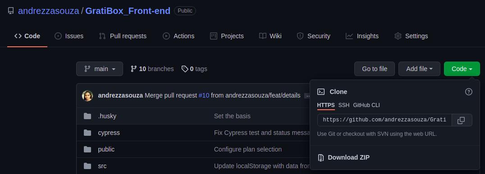

# Gratibox

Gratibox é um aplicativo focado em bem estar.

## Problema

Visando estimular um estilo de vida mais saudável você idealizou uma startup que entrega box com produtos saudáveis e de #gratidão. Os clientes poderão escolher entre dois planos de assinatura recorrente, semanal ou mensal. Cada box contém produtos sortidos como chás, produtos orgânicos, incensos. Os clientes não podem escolher os produtos e não sabem o que será enviado em cada box.

## Como funciona?

O front-end deverá ser uma Single Page Application em React, que se comunique com o back-end através de API;

O back-end da aplicação deverá ser feito em Node.js;

O banco de dados deverá ser Postgres;

### **Login**

Após o login, existem dois possíveis caminhos:

Se o cliente tiver assinado um plano ele deverá visualizar informações do seu plano:

- Tipo de plano
- Data da assinatura
- Dia de entrega recorrente
- Visualizar as datas de entrega para mês atual
  - Plano Mensal: Se o dia escolhido cair em um final de semana mostrar o próximo dia útil
  - Plano Semanal: Mostrar os dias (dd/mm/aaaa) que serão feitas na entrega. As entregas são feitas nos feriados.

Se o cliente ainda não tiver assinado um plano ele poderá selecionar um dos planos e finalizar, escolher a data de entrega e finalizar a compra.

Para a data de entrega o cliente poderá escolher uma entre as opções:

- Mensal: Dia 01, Dia 10, Dia 20.
- Semana: Segunda, Quarta, Sexta.

### **Assinar**

A assinatura é dividia em duas páginas, send a primeiro dados do plano e a segunda dados de entrega.

- Dados do Plano
  - Tipo do Plano:
    - Semanal
    - Mensal
  - Entrega:
    - Mensal: Dia 01, Dia 10, Dia 20.
    - Semanal: Segunda, Quarta, Sexta.
  - Quero Receber: O cliente poderá escolher entre uma a três opções
    - Chás
    - Incensos
    - Produtos orgânicos
  - Dados de Entrega
    - Nome completo
    - Endereço de entrega
    - CEP
    - Cidade
    - Estado

## Layout

Esse projeto é baseado neste layout do Figma: https://www.figma.com/file/wHTsMeg2oVdW96ptraU2Gb/GratiBox?node-id=0%3A1

## Front-end e back-end

Esse projeto é composto por duas partes:

- Front-end: https://github.com/andrezzasouza/GratiBox_Front-end
- Back-end: https://github.com/andrezzasouza/GratiBox_Back-end

## Tecnologias usadas

- Javascript
- React JS
- Node.js
- Jest
- Supertest
- Cypress

## O que é necessário ter para rodar esse projeto

- É necessário instalar o npm: https://nodejs.org/en/download/

## Preparando para rodar o projeto:

<b>a. Pegar link para 'Clone' nesta página e copiando:</b>

 
 
<b>b. Clonar no terminal:</b>

- Front-end:
<blockquote>
  git clone https://github.com/andrezzasouza/GratiBox_Front-end.git
</blockquote>
 
- Back-end:

<blockquote>
  git clone https://github.com/andrezzasouza/GratiBox_Back-end.git
</blockquote>
 
<b>c. Instalar dependências</b>

<blockquote>
  npm i
</blockquote>
  

## Preparar o back-end e o banco de dados

- Usar o arquivo dump.sql para criar o banco de dados do projeto

- Preencher o arquivo .env.example com os dados para conectar com seu banco.

## Iniciando o projeto no terminal

- Front-end
<blockquote>
  npm start
</blockquote>

- Back-end
<blockquote>
  npm start
</blockquote>
